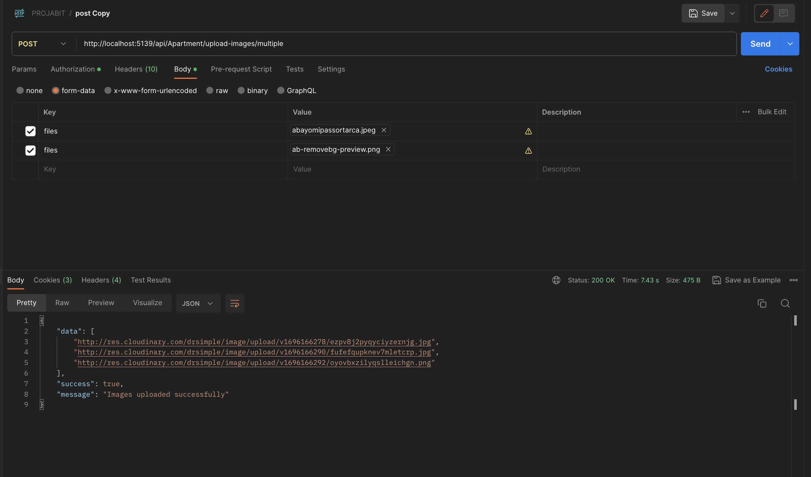

###### Creating a Web API application in .NET Core using Authorization Filters involves several steps. Below is a step-by-step guide to create a simple API application with user authentication using the Repository pattern.


##### Create a new proj
- dotnet new webapi -n MyApi

##### Create a new Class
```csharp
public class User
{
    public int Id { get; set; }
    public string Name { get; set; }
    public string Email { get; set; }
    public string Password { get; set; }
    public DateTime CreatedAt { get; set; } = DateTime.Now;
    public DateTime UpdatedAt { get; set; } = DateTime.Now;
}

```

##### DataContext
```csharp
public class DataContext : DbContext
{
    public DataContext(DbContextOptions<DataContext> options) : base(options) { }
    public DbSet<User> Users { get; set; }
}
```

##### Create Dto
```csharp
public class CreateUserDto
{
    public string Name { get; set; }
    public string Email { get; set; }
    public string Password { get; set; }
}
```

##### Read Dto
```csharp
public class ReadUserDto
{
    public int Id { get; set; }
    public string Name { get; set; }
    public string Email { get; set; }
}
```

##### Generic Response
```csharp
public class Response<T>
{
    public T Data { get; set; }
    public bool Success { get; set; } = true;
    public string Message { get; set; }
}
```

##### Create a new Interface
```csharp
public interface IUserRepository
{
    Task<Response<ReadUserDto>> CreateUserAsync(CreateUserDto createUserDto);
    Task<Response<ReadUserDto>> GetUserAsync(int id);
    Task<Response<ReadUserDto>> UpdateUserAsync(int id, CreateUserDto createUserDto);
    Task<Response<ReadUserDto>> DeleteUserAsync(int id);
    Task<Response<IEnumerable<ReadUserDto>>> GetUsersAsync();
    Task<Response> LoginAsync(string email, string password);
}
```


###### Install the Bcrypt package to hash the password
- dotnet add package BCrypt.Net-Next --version 4.0.2

##### Install the JWT package
- dotnet add package Microsoft.AspNetCore.Authentication.JwtBearer --version 3.1.10

##### Install the Entity Framework package
dotnet add package Microsoft.EntityFrameworkCore
dotnet add package Microsoft.EntityFrameworkCore.SqlServer
dotnet add package Microsoft.EntityFrameworkCore.Tools
dotnet add package Microsoft.EntityFrameworkCore.Design

###### User Repository
```csharp
using AuthFilterProj.Data;
using AuthFilterProj.Dtos;
using AuthFilterProj.Interface;
using AuthFilterProj.Models;
using AuthFilterProj.Utils;
using Microsoft.EntityFrameworkCore;

namespace AuthFilterProj.Service
{
    public class UserRepository : IUserRepository
    {
        private readonly DataContext _context;
        private readonly IConfiguration _configuration;

        private readonly ILogger<UserRepository> _logger;

        public UserRepository(DataContext context, IConfiguration configuration, ILogger<UserRepository> logger)
        {
            _context = context;
            _configuration = configuration;
            _logger = logger;
        }

        public async Task<Response<ReadUserDto>> CreateUserAsync(CreateUserDto createUserDto)
        {
            var user = new User
            {
                Name = createUserDto.Name,
                Email = createUserDto.Email,
                Password = BCrypt.Net.BCrypt.HashPassword(createUserDto.Password)
            };

            await _context.Users.AddAsync(user);
            await _context.SaveChangesAsync();
            

            var readUserDto = new ReadUserDto
            {
                Id = user.Id,
                Name = user.Name,
                Email = user.Email
            };

            var response = new Response<ReadUserDto>
            {
                Data = readUserDto,
                Message = "User created successfully!"
            };

            _logger.LogInformation("User created successfully!");

            return response;
        }

        public async Task<Response<ReadUserDto>> GetUserAsync(int id)
        {
            var user = await _context.Users.FindAsync(id);

            if (user == null)
            {
                return new Response<ReadUserDto>
                {
                    Success = false,
                    Message = "User not found."
                };
            }

            var readUserDto = new ReadUserDto
            {
                Id = user.Id,
                Name = user.Name,
                Email = user.Email
            };

            var response = new Response<ReadUserDto>
            {
                Data = readUserDto,
                Message = "User retrieved successfully!"
            };

            return response;
        }

        public async Task<Response<IEnumerable<ReadUserDto>>> GetUsersAsync()
        {
            var users = await _context.Users.ToListAsync();

            var readUsersDto = users.Select(u => new ReadUserDto
            {
                Id = u.Id,
                Name = u.Name,
                Email = u.Email
            });

            var response = new Response<IEnumerable<ReadUserDto>>
            {
                Data = readUsersDto,
                Message = "Users retrieved successfully!"
            };

            return response;
        }

        public async Task<Response<ReadUserDto>> UpdateUserAsync(int id, CreateUserDto createUserDto)
        {
            var user = await _context.Users.FindAsync(id);

            if (user == null)
            {
                return new Response<ReadUserDto>
                {
                    Success = false,
                    Message = "User not found."
                };
            }

            user.Name = createUserDto.Name;
            user.Email = createUserDto.Email;
            user.Password = BCrypt.Net.BCrypt.HashPassword(createUserDto.Password);
            user.UpdatedAt = DateTime.Now;

            await _context.SaveChangesAsync();

            var readUserDto = new ReadUserDto
            {
                Id = user.Id,
                Name = user.Name,
                Email = user.Email
            };

            var response = new Response<ReadUserDto>
            {
                Data = readUserDto,
                Message = "User updated successfully!"
            };

            return response;
        }

        public async Task<Response<ReadUserDto>> DeleteUserAsync(int id)
        {
            var user = await _context.Users.FindAsync(id);

            if (user == null)
            {
                return new Response<ReadUserDto>
                {
                    Success = false,
                    Message = "User not found."
                };
            }

            _context.Users.Remove(user);
            await _context.SaveChangesAsync();

            var readUserDto = new ReadUserDto
            {
                Id = user.Id,
                Name = user.Name,
                Email = user.Email
            };

            var response = new Response<ReadUserDto>
            {
                Data = readUserDto,
                Message = "User deleted successfully!"
            };

            return response;
        }

        public async Task<Response<LoginResponseDto>> LoginAsync(LoginDto loginRequestDto)
        {
            // Find the user by email in your database
            var user = await _context.Users.FirstOrDefaultAsync(u => u.Email == loginRequestDto.Email);

            if (user == null)
            {
                // User not found, return an error response
                return new Response<LoginResponseDto>
                {
                    Success = false,
                    Message = "Invalid credentials."
                };
            }

            // Verify the password
            if (!BCrypt.Net.BCrypt.Verify(loginRequestDto.Password, user.Password))
            {
                // Password doesn't match, return an error response
                return new Response<LoginResponseDto>
                {
                    Success = false,
                    Message = "Invalid credentials."
                };
            }

            // Password is correct, generate a token
            var tokenUtils = new TokenUtils(_configuration["JWT:SecretKey"]);
            var loginResponseDto = new LoginResponseDto
            {
                Token = tokenUtils.GenerateToken(user)
            };

            // Return a success response with the token
            return new Response<LoginResponseDto>
            {
                Success = true,
                Data = loginResponseDto,
                Message = "User logged in successfully!"
            };
        }


    }
}
```

###### Create a new Controller
```csharp

using System.Security.Claims;
using AuthFilterProj.Dtos;
using AuthFilterProj.Interface;
using Microsoft.AspNetCore.Authorization;
using Microsoft.AspNetCore.Mvc;

namespace AuthFilterProj.Controllers
{
    [ApiController]
    [Route("api/[controller]")]
    public class UsersController : ControllerBase
    {
        private readonly IUserRepository _userRepository;
        private readonly ILogger<IUserRepository> _logger;

        public UsersController(IUserRepository userRepository, ILogger<IUserRepository> logger)
        {
            _userRepository = userRepository;
            _logger = logger;
        }

        [HttpPost]
        public async Task<IActionResult> CreateUserAsync(CreateUserDto createUserDto)
        {
            var response = await _userRepository.CreateUserAsync(createUserDto);

            if (!response.Success)
            {
                return BadRequest(response);
            }

            return Ok(response);
        }

        [HttpGet("{id}")]
        [Authorize]
        public async Task<IActionResult> GetUserAsync(int id)
        {
            // Access user claims
            var userIdClaim = User.FindFirst(ClaimTypes.NameIdentifier);
            var userEmailClaim = User.FindFirst(ClaimTypes.Email);

            if (userIdClaim != null && userEmailClaim != null)
            {
                var userId = userIdClaim.Value;
                var userEmail = userEmailClaim.Value;

                _logger.LogInformation($"User with ID: {userId} and Email: {userEmail} is requesting user information.");
            }
            var response = await _userRepository.GetUserAsync(id);

            if (!response.Success)
            {
                return NotFound(response);
            }
            return Ok(response);
        }

        [HttpGet]
        public async Task<IActionResult> GetUsersAsync()
        {
            var response = await _userRepository.GetUsersAsync();

            return Ok(response);
        }

        [HttpPut("{id}")]
        public async Task<IActionResult> UpdateUserAsync(int id, CreateUserDto createUserDto)
        {
            var response = await _userRepository.UpdateUserAsync(id, createUserDto);

            if (!response.Success)
            {
                return NotFound(response);
            }

            return Ok(response);
        }

        [HttpDelete("{id}")]
        public async Task<IActionResult> DeleteUserAsync(int id)
        {
            var response = await _userRepository.DeleteUserAsync(id);

            if (!response.Success)
            {
                return NotFound(response);
            }

            return Ok(response);
        }
    }
}
```

###### Login Controller
```csharp


using AuthFilterProj.Dtos;
using AuthFilterProj.Interface;
using Microsoft.AspNetCore.Mvc;

namespace AuthFilterProj.Controllers
{
    [ApiController]
    [Route("[controller]")]

    public class AuthControlller: ControllerBase
    {
        private readonly IUserRepository _userRepository;

        public AuthControlller(IUserRepository userRepository)
        {
            _userRepository = userRepository;
        }
        
          [HttpPost("login")]
        public async Task<IActionResult> LoginAsync(LoginDto loginDto)
        {
            var response = await _userRepository.LoginAsync(loginDto);

            if (!response.Success)
            {
                return BadRequest(response);
            }

            return Ok(response);
        }
    }
}
```

###### Program.cs
```csharp
using System.Text;
using AuthFilterProj.Data;
using AuthFilterProj.Interface;
using AuthFilterProj.Service;
using Microsoft.EntityFrameworkCore;
using Microsoft.IdentityModel.Tokens;

var builder = WebApplication.CreateBuilder(args);

builder.Services.AddDbContext<DataContext>(options =>
    options.UseSqlServer(builder.Configuration.GetConnectionString("DefaultConnection")));

builder.Services.AddScoped<IUserRepository, UserRepository>();


builder.Services.AddAuthentication("Bearer")
    .AddJwtBearer("Bearer", options =>
    {
        options.TokenValidationParameters = new TokenValidationParameters
        {
            ValidateIssuer = false,
            ValidateAudience = false, 
            ValidateLifetime = true,
            ValidateIssuerSigningKey = false,
            ValidIssuer = builder.Configuration["Jwt:Issuer"],
            ValidAudience = builder.Configuration["Jwt:Issuer"],
            IssuerSigningKey = new SymmetricSecurityKey(Encoding.UTF8.GetBytes("This is a secret key"))
        };
    });


builder.Services.AddControllers();
builder.Services.AddEndpointsApiExplorer();
builder.Services.AddSwaggerGen();

var app = builder.Build();

if (app.Environment.IsDevelopment())
{
    app.UseSwagger();
    app.UseSwaggerUI();
}

app.UseHttpsRedirection();

app.UseAuthentication();

app.UseAuthorization();

app.MapControllers();

app.Run();
```

###### appsettings.json
```json
{
  "ConnectionStrings": {
    "DefaultConnection": "Server=localhost;Database=AuthFilterProj;Trusted_Connection=True;MultipleActiveResultSets=true"
  },
  "Jwt": {
    "SecretKey": "This is a secret key",
    "Issuer": "https://localhost:5001"
  },
  "AllowedHosts": "*"
}
```


##### If you want to use filter to get the invalid token or expired token etc

```csharp

```

##### Install MailKit
- dotnet add package MailKit --version 2.15.0

#### CloudinaryDotNet
- dotnet add package CloudinaryDotNet --version 1.13.1


##### Multiple pictures


#### install goolge dotnet add package Google.Apis.Auth
- dotnet add package Google.Apis.Auth

dotnet add package Serilog.AspNetCore
dotnet add package Serilog.Sinks.File

#### fix to google issue
https://stackoverflow.com/questions/68438293/the-given-origin-is-not-allowed-for-the-given-client-id-gsi


